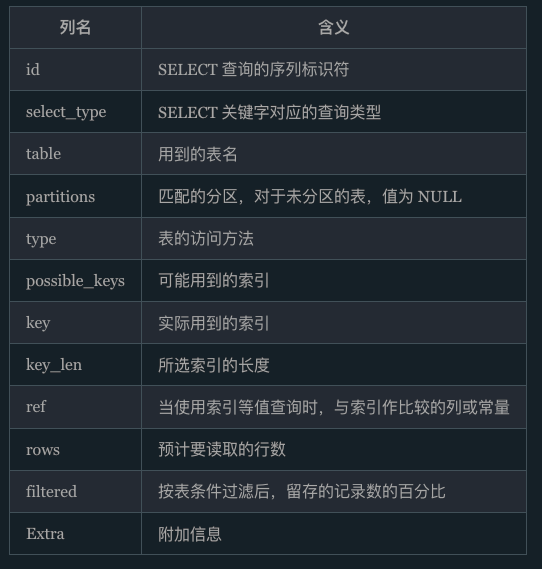
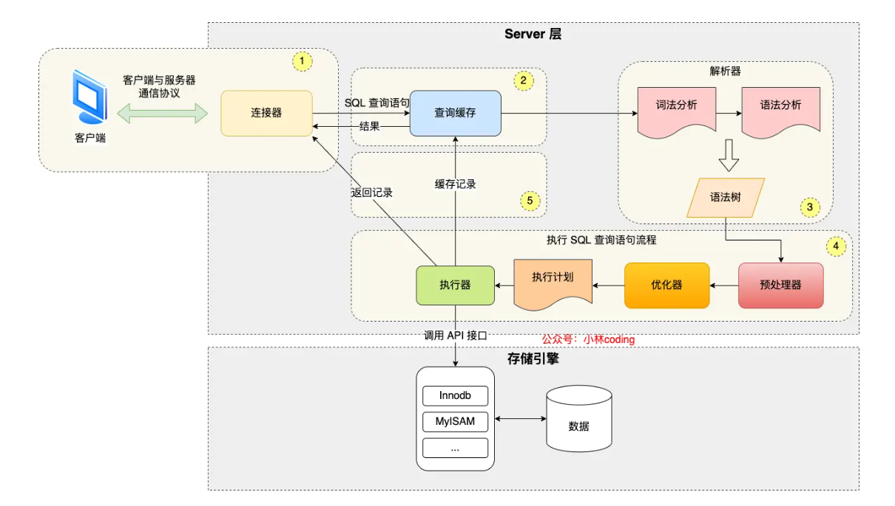
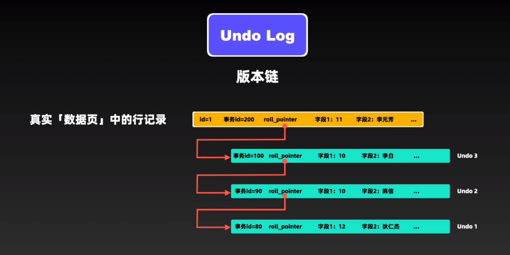

# 疑问
1. 非聚集索引/二级索引 具体是什么意思？为什么不直接指向原始数据？

[https://blog.csdn.net/moakun/article/details/81813994](https://blog.csdn.net/moakun/article/details/81813994)

存储地址，在B+树平衡操作的时候会变地址，那么，其他的索引就要修改，就非常麻烦了

1. 语法树怎么构建的？联合索引当遇到范围查询 (>、<) 就会停止匹配，也就是 **age 字段能用到联合索引，但是 reward 字段则无法利用到索引**。

# Explain
[MySQL执行计划分析](https://javaguide.cn/database/mysql/mysql-query-execution-plan.html#key-重要)

## 判断是否走索引
```plain
explain select * from tablename;
```



type: 它是最重要的列，用以判断性能的高低。它显示了连接类型。有以下几种可能的值：系统(system)、const、eq_ref、ref、range、index和ALL，它们的性能从左向右依次下降。类型为"all"的查询是最糟糕的，意味着MySQL需要从头到尾扫描整个表来找出相匹配的行。"index"意味着MySQL将扫描整个索引来找到相应的行。更好的类型如下: ref（在所有与索引值匹配的行之间进行搜索）、eq_ref（在与索引值相等的行中进行搜索）、const和system（仅当MySQL对查询的部分进行优化并将其转换为一个常量时，才会是这两种类型

ref:

+ `NULL`：表示没用到索引，或者在某些情况下使用了全索引扫描。
+ 系列名（col_name）：表示使用了索引并且查询条件中有等值条件，这个值就是查询条件中的列或常量值。
+ 函数名：表示索引被用于查找某个结果值，该值必须通过先计算得出。

filtered:这个也是很重要的

## MySQL Explain Extra字段
|name|description| |-|-| |Using where|MySQL服务器将在存储引擎检索行后再进行过滤| |Using index|查询可以通过使用索引来避免访问表。| |Using index condition|MySQL服务器将在存储引擎层使用索引条件推送（ICP）| |Using temporary|MySQL需要创建一个临时表来处理查询。这通常发生在对不同列的排序和分组操作中。| |Using filesort|MySQL需要进行额外的排序步骤，通常是因为查询包含ORDER BY子句，并且排序的顺序不能由读取用于检索行的索引来完成| |Range checked for each record (index map: N)|没有好的索引可以使用，对于从前一个表中检索的每一行，都会检查是否可以使用索引来搜索这个表| |Impossible WHERE noticed after reading const tables|MySQL已经读取了所有的const（常数）表，并且WHERE子句是不可能的。 |

# 图解MySQL
## 一、基础篇
### 执行一条 select 语句，期间发生了什么？


#### 1.连接器
#### 2.缓存（mysql 8.0已经删除）
#### 3.解析sql
#### 4.执行sql
分三个阶段

+ prepare 阶段，也就是预处理阶段
+ optimize 阶段，也就是优化阶段；
+ execute 阶段，也就是执行阶段；

**prepare预处理阶段：**

主要做了这两件事:

+ 检查 SQL 查询语句中的表或者字段是否存在；
+ 将 `select *` 中的 `*` 符号，扩展为表上的所有列；

**optimize阶段：**

主要就是和索引相关，为了优化查询速度

## 二、索引篇
## MySQL5.6之后建立索引可以使用
```plain
ALTER TABLE table_name ADD INDEX index_name (column_name), ALGORITHM=INPLACE, LOCK=NONE;
```

ALGORITHM=INPLACE告诉MySQL使用Online DDL，并且LOCK=NONE确保在添加索引的过程中允许对表进行读写操作

### 聚簇和非聚簇索引
聚簇索引：一般用primary key作为索引建立B+树，若是没有，用第一个unique作为索引，还是没有，mysql会建立一个隐藏的列作为索引。

## B树和B+树
B树不利于便利所有的数据

## MVCC
MVCC通过Undo log和Read view视图实现的

### undo log
在mvcc中，undo log会对每条记录都有一个版本链



### read view
决定了要当前事务应该读取哪个undo log的版本作为结果

```plain
class ReadView {
  /* ... */
private:
   ids_t m_ids;                  /* 创建 Read View 时的活跃事务列表,也就是所有没有提交的事务 */
  trx_id_t  m_up_limit_id;      /* 大于等于这个 ID 的事务均不可见。但是值是最大的，m_ids最大值+1 */

  trx_id_t m_low_limit_id;       /* 小于这个 ID 的事务均可见,m_ids的最小值 */

  trx_id_t m_creator_trx_id;    /* 创建该 Read View 的事务ID */

  trx_id_t m_low_limit_no;      /* 事务 Number, 小于该 Number 的 Undo Logs 均可以被 Purge */


  m_closed;                     /* 标记 Read View 是否 close */
}
```

读一条数据的时候流程

1. 读取数据的undo log的链表上的第一个记录的提交事务id
2. 判断是不是等于自己的事务id，是自己的肯定能读，否则下一步
3. 判断是不是小于m_ids中最小的事务id，如果小于，说明这条记录在创建read view时已经提交，可读，否则下一步
4. 判断是不是大于等于m_ids最大事务id+1如果，如果是那么直接读取undo log的下一条记录的事务id重复刚刚流程，不是的话，下一步
5. 判断是不是在当前的m_ids中，如果不在，说明条记录在创建read View时已经提交，可以读，否则读取undo log的下一条记录的事务id重复上述流程

tips:

+ `Read View`通常在事务第一次执行快照读操作时创建
+ 如果就算一个事务id活跃事务列表中，它已经提交了，但是只是创建read view的时候它还在活跃列表中，所以为什么这个不能读呢？答：因为如果这个可以读的话，就会出现不可重复读的问题。

## 三、锁
ddl锁相关知识：[https://developer.aliyun.com/article/1111994](https://developer.aliyun.com/article/1111994)

根据粒度划分：

1. 全局锁：即对整个数据库都上锁
2. 表级锁：表锁，元数据锁，意向锁，AUTO-INC锁（自增锁）
3. 行级锁：Record Lock, Gap Lock, Next-key Lock

根据性质划分：

1. 共享锁（读锁）
2. 排斥/独占锁（写锁）

根据思想划分：

1. 乐观锁
2. 悲观锁

## 四、慢查询优化
### 1. 慢查询日志：
show_query_log:是否开启慢查询

show-query-log-file:慢查询日志的文件目录

long_query_time:定义慢查询的阈值 但是，我感觉，也可以使用一些常驻进程的性能分析工具，可能也可以定位到耗时的地方

### 2. sql性能下降的原因
查询语句本身有问题

索引失效

join查询太多

mysql参数的配，或者系统问题

## 创建用户
```plain
-- 创建数据库 my_test
CREATE DATABASE my_test;

-- 创建用户 my_test，密码为 Wwky926996.，并允许任何 IP 访问
CREATE USER 'my_test'@'%' IDENTIFIED BY 'Wwky926996.';

-- 授予 my_test 用户对 my_test 数据库的所有权限
GRANT ALL PRIVILEGES ON my_test.* TO 'my_test'@'%';

-- 刷新权限表
FLUSH PRIVILEGES;
```

