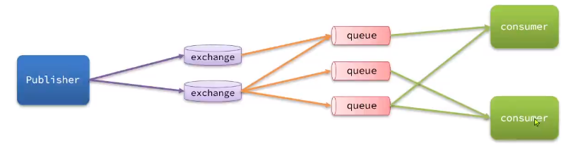
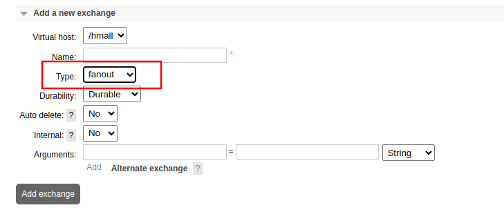
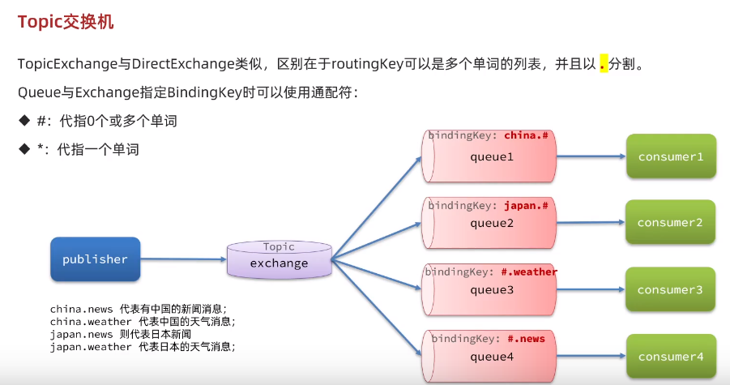
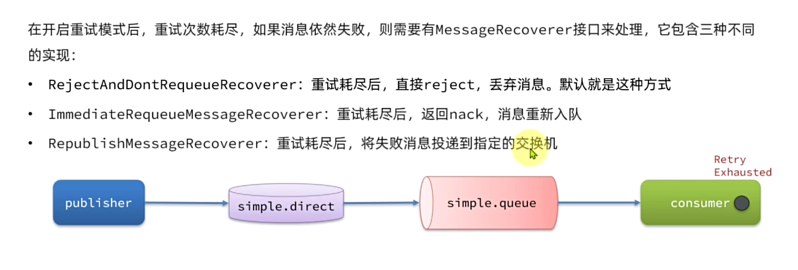
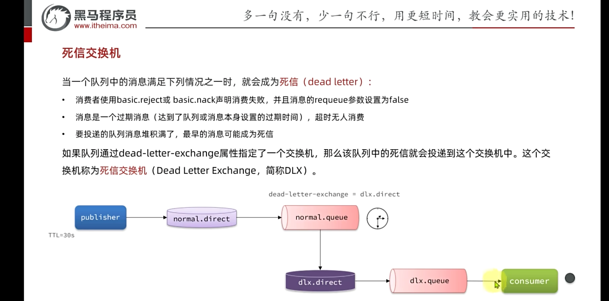
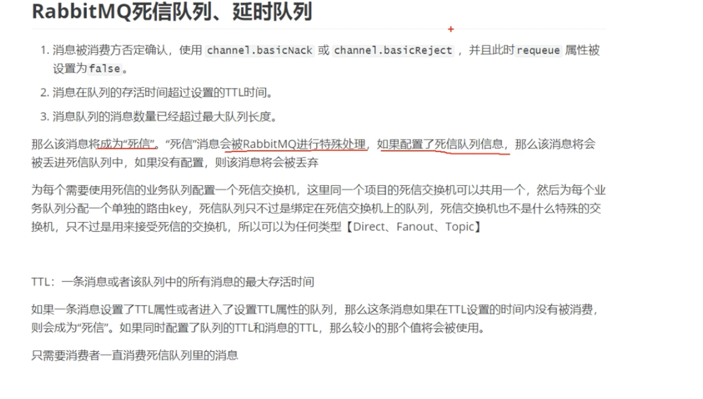
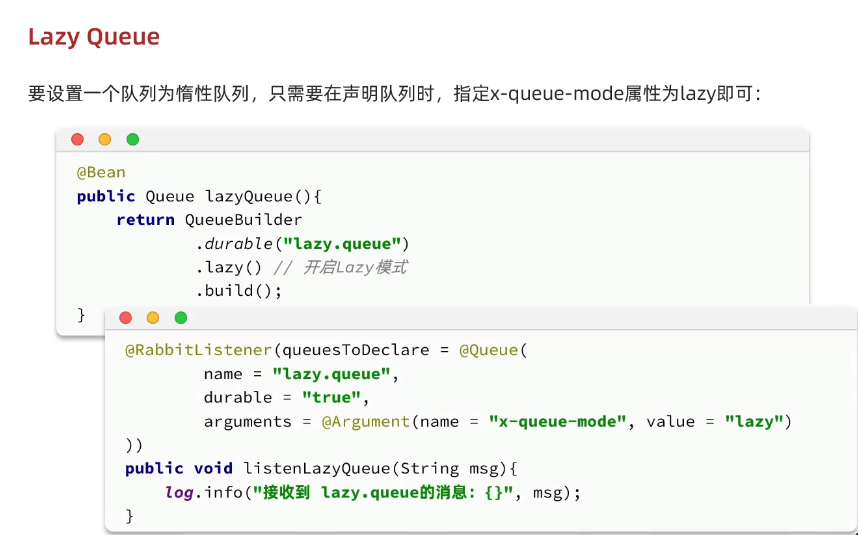
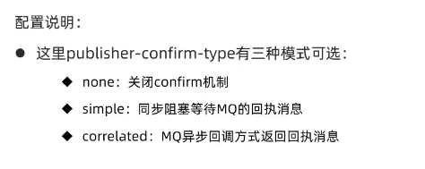
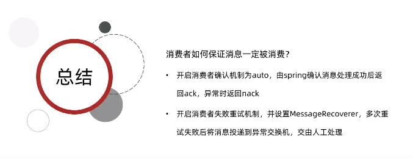

# RabbitMQ整体架构
+ publisher：消息发送者
+ consumer：消息消费者
+ queue：队列，存储消息
+ exchange：交换机，负责路由消息




# 终端管理用户
```plain
rabbitmqctl set_user_tags [username] [tag]
```


```plain
rabbitmqctl set_user_tags oneq administrator
```


# 消息堆积问题如何处理？
1. 可以对一个消息队列绑定多个消费者


# 交换机的类型


2. Fanout广播型交换机，每queue都收到
3. Direct交换机，相当于是有路径（routingKey）的分发消息。根据队列绑定的key不同，发给不同的queue，其实，也是Fanout交换机的替代，你只要给queue配置同样的bindingkey，生产者routingkey和这个bingkey一样就将消息发给多个queue
4. Topic交换机，和Direct相似，但是Topic绑定支持通配符(#:表示多个单词,*:表示一个单词)绑定




# 消息可靠性
> 总的来说：  
生产者：
>

1. 消息重试机制
2. 消息确认机制  
消息队列：
3. 持久化  
消费者：
4. 消息确认机制
5. 消息重试机制


## 生产者发送消息重试
网络有时候会不稳定，可以重复尝试发送消息

## 生产者重连
网络问题，可能发送消息会比较慢

## 生产者可靠性
ReturnCallback 同步阻塞

ConfirmCallback 异步


## 消费者确认
```plain
spring: 
  rabbitmq:
    listener:
       simple:
         acknowledge-mode:auto # 1.none  2.manual 3.auto
```


ack:成功，消息队列移除这条消息

nack:消费者处理消息异常，让消息队列再次投递

reject:消息可能格式有问题，转换不成功直接拒绝这条消息

## 消费者重试
```plain
spring: 
  rabbitmq:
    listener:
       simple:
        retry:
          enabled: true
          # 还有重试次数等其他配置信息
```





## 业务幂等性
一个业务执行多次和执行一次是一样的结果


# 延迟消息
可以做延时任务。

往消息队列中投递一条消息，后过一段时间让消费者消费，这样，消费者收到消息就可以开始做那个消息的任务。


使用消息过期时间，创建一个延时消息




## 死信队列


# LazyQueue
消息直接写到磁盘，克服磁盘持久化要给内存写又要给磁盘写的问题



# SpringAMQP
## Maven依赖
```plain
<dependency>
    <groupId>org.springframework.boot</groupId>

    <artifactId>spring-boot-starter-amqp</artifactId>

</dependency>

```


## yaml配置文件
### publisher
```plain
spring:
  rabbitmq:
    host: 127.0.0.1
    port: 5672
    virtual-host: /hmall
    username: hmall
    password: 123456
```


#### 生产者消息确认
```plain
spring:
  rabbitmq:
    publisher-config-type: correlated
```





### consumer
```plain
spring:
  rabbitmq:
    host: 127.0.0.1
    port: 5672
    virtual-host: /hmall
    username: hmall
    password: 123456
    listener:
      simple:
        prefetch: 1
```


设置prefetch值为1，表示消费者一次只处理一个消息。消费者必须确认这个消息之后，才会收到下一个消息。

这样使得消息能够能者多劳，跑的快的，执行多点

如果不配置，会默认给每个消费者平均分配


### 消费者确认
```plain
spring:
  rabbitmq:
    listener:
      simple:
        acknowledge-mode: auto # 开启自动消费者确认 默认none，还有，manual和auto模式
        retry:
          enabled: true # 自动重新测试
```




## 接收消息
```plain
@Component
public class MqListener {

  @RabbitListener(queues = "simple.queue")
  public void listenerSimpleQueue(String msg) {
      log.info("消费者收到了消息:" + msg);
  }
}
```


消费者只关心queues


## 发送消息
```plain
@Autowired
private RabbitTemplate rabbitTemplate;
```


发送消息可以直接发送到队列

```plain
@Test
void testSendMessageToQueue() {
    String queueName = "work.queue";// 消息队列名
    for (int i = 0; i < 50; i++) {
        rabbitTemplate.convertAndSend(queueName, "messge:" + i);
    }
}
```


也可以发送到交换机

```plain
@Test
void testSendMessageToExchange() {
    String exchangeName = "hmall.fanout";
    for (int i = 0; i < 10; i++) {
        rabbitTemplate.convertAndSend(exchangeName, null, "msg" + i);
    }
}
```


交换机的区别参考（）

